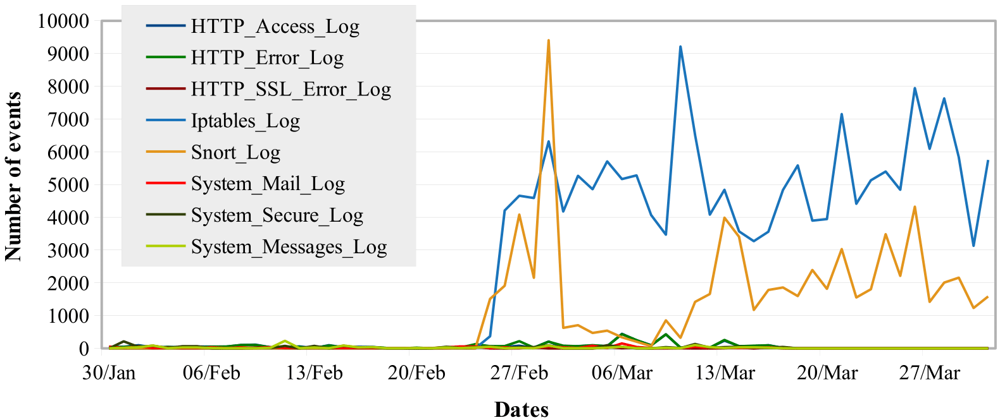

# Labelled-SotM34-dataset

The selected experimental dataset for evaluating the UAHL is the <a href="http://honeynet.onofri.org/scans/scan34/" target="_blank">`SotM34`</a> dataset, which consists of heterogeneous log-files collected from a honeynet that was targeted by several attacks in which some of them have successfully managed to compromise the targeted device. The dataset includes Apache logs, Linux Syslog, Snort NIDS logs, and IPtables Firewall logs. Fig. 4 shows the time disruption of those entries.

     
  Figure 1 - SotM34 Dataset - Events’ Time Distribution

The dataset is provided from the source in its original format (TXT) without preprocessing or labelling for events. To the best of our knowledge, there is no available preprocessed version of the SotM34 dataset. Therefore, we have produced a preprocessed and labelled version of the dataset as illustrated in the following subsections.

---

## Dataset pre-processing:
  - Split log-files were combined into their main files.
  - The HTTP and SYSLOG events are differed by 287 minutes against the IPTables Firewall log. Thus, all times in the HTTP and SYSLOG files were modified (287 minutes added to all events).
  - Datetimes format was unified for all events in the dataset (i.e. ”%Y-%m-%d %H:%M:%S”)
  - Feature sets were assigned for the log-files based on their structure. The following table shows the lists of extracted features.

	<small>

	 | Log-file Name	| Set of Features |
	 |:----------------:|:---------------:|
	 |	HTTP_Access		|	Date~, Time~, ClientIP$, HTTP_method, ClientRequestLine@,  Http_protocol@, StatusCode, ObjectSize~, Referrer~, Agent@ |
	 |	HTTP_Error		|	Date~, Time~, Type, ClientIP$, Reason_Phrase, Message@ |
	 |	HTTP_SSL_Error	|	Date~, Time~, Type, Message@ |
	 |	SYSLOG_Messages	|	Date~, Time~, Logging_device~, Logging_Daemon, PID~,  Operation@, User, Tty, UID, EUID, Remotehost@, System_message@ |
	 |	SYSLOG_Secure	|	Date~, Time~, Logging_device~, Logging_Daemon,  PID~, Operation, User, Source$, Port~ |
	 |	SYSLOG_Mail		|	Date~, Time~, Logging_device~, Logging_Daemon, PID~, QID~, From,  To, Size~, Class, nrcpts, Protocol, Daemon, msgid~, relay, Ruleset,  arg1, Ctladdr@, delay@, xdelay@, mailer, pri~, reject@, dsn@, stat@ |
	 |	SNORT			|	Date~, Time~, Logging_device~, RuleNumber@, Rule@, Classification~, Priority~, Protocol, SrcIP\$, SrcPort~, DstIP$, DstPort~ |
	</small>

  - Blank cells were replaced with hyphens ”-”  
  - Log-files were converted into CSV files. Thus they can be easily imported into our framework as dataframes. The sets of features are extracted based on documentations of the HTTP server, Snort, and Unix logging system. Furthermore, indicators were added at the end of feature names to identify types of data inside the columns (”@” for text data, ”~” for ordinal categorical data, ”$” for IP addresses, and none for nominal categorical data).

---

## Events Labelling:
Technical description reports <a href="../Analysis_reports/" target="_blank">`[Click here]`</a> have described, in detail, attacks and structure of the SotM34 dataset. The reports provide sources and types of attacks in the log-files, which were analysed by domain experts. These reports were cross validated and then used to label the dataset’s events. Consequently, 80591 events were labelled as shown in the following table:

| Log-file Name		| No. of Events | No. of Unique Labels 	|
|:-----------------:|:-------------:|:---------------------:|
|	HTTP_Access		|	3554		|			12			|
|	HTTP_Error		|	3692		|			12			|
|	HTTP_SSL_Error	|	374			|			4			|
|	SYSLOG_Messages	|	1166		|			11			|
|	SYSLOG_Secure	|	1587		|			6			|
|	SYSLOG_Mail		|	1172		|			7			|
|	SNORT			|	69039		|			26			|
|	**Total**		|	**80591**	|	 	  **78**		|

---

## Details of the labels used for each log-file:

- **HTTP_Access file:**
	-	A01: Failed access attempt to Files/Paths (status code: 404)
	-	A02: Failed access attempt to Files/Paths (status code: 400)
	-	A03: Failed "POST" requests (status code 404)
	-	A04: CONNECT requests (status code 405)
	-	A05: Forbidden access attempt to the root directory
	-	A06: Forbidden access attempt to websites
	-	A07: Forbidden access attempt to other paths/files
	-	A08: Proxy request (status code: 404)
	-	A09: OPTIONS Scan (status code 200)
	-	A10: Scan for vulnerable PHP scripts (status code: 404)
	-	A11: Scan for vulnerable PHP scripts (status code: 200)
	-	A12: Scan for vulnerable PHP scripts (status code: 500)

- **HTTP_Error_Log file:**
	-	B01: File/directory does not exist
	-	B02: Directory index forbidden by rule
	-	B03: Script not found or unable to stat
	-	B04: Attempt to invoke directory as script
	-	B05: Attempt to serve directory
	-	B06: Request without hostname
	-	B07: sh connection errors (No such file or directory/no job control)
	-	B08: The timeout specified has expired
	-	B09: Broken pipe
	-	B10: Errors/Messages while connections
	-	B11: System messages (notice: Apache server messages)
	-	B12: System messages (warn: Child process still did not exit)

- **HTTP_SSL_Error_Log file:**
	-	C01: SSL handshake failed/interrupted
	-	C02: Spurious SSL handshake interrupt
	-	C03: SSL Library Error
	-	C04: System messages (including RSA_server_certificate messages)

- **Syslog_Messages file:**
	-	D01: Message repeated
	-	D02: Failed SSH login
	-	D03: CUPS messages (CUPS is the Common UNIX Print System)
	-	D04: Syslog messages (syslog & syslogd & syslogd 1.4.1)
	-	D05: HTTP messages (Apache Server)
	-	D06: rpc.statd messages
	-	D07: kernel messages (including all subprocesses activated during the Kernel processes)
	-	D08: Xinetd messages
	-	D09: Session opened/closed (su daemon)
	-	D10: Session opened/closed (sshd daemon)
	-	D11: Session opened/closed (login daemon)

- **Syslog_Secure file:**
	-	E01: Accepted password
	-	E02: Illegal user
	-	E03: Failed password
	-	E04: Did not receive identification string
	-	E05: Scanned
	-	E06: Xinetd messages

- **Syslog_Maillog file:**
	-	F01: Sent mails
	-	F02: Message accepted for delivery
	-	F03: Connection related messages (Alert: Did not issue MAIL/EXPN/VRFY/ETRN during connection to MTA)
	-	F04: Connection related messages (rejecting/lost connections)
	-	F05: Connection related messages (pop3 service messages)
	-	F06: Connection related messages (Other server messages)
	-	F07: Repeated messages

- **Snortlog file:**
	-	G01: Spade: Closed dest port used
	-	G02: Spade: Source used odd dest port
	-	G03: Potential Corporate Privacy Violation
	-	G04: Web Application Attack
	-	G05: Access to a potentially vulnerable web application
	-	G06: An attempted login using a suspicious username was detected
	-	G07: Potentially Bad Traffic
	-	G08: A Network Trojan was detected
	-	G09: Detection messages (spp_stream4)
	-	G10: Attempted Information Leak - Automated NMAP TCP scan
	-	G11: Attempted Information Leak - NMAP ICMP PING
	-	G12: Attempted Information Leak - WEB-MISC http directory traversal
	-	G13: Attempted Information Leak - DOUBLE DECODING ATTACK
	-	G14: Attempted Information Leak - DNS named version attempt
	-	G15: Executable code was detected (SHELLCODE x86 NOOP)
	-	G16: Executable code was detected (BARE BYTE UNICODE ENCODING)
	-	G17: Detection of a Network Scan
	-	G18: Decode of an RPC Query (UDP connection)
	-	G19: Decode of an RPC Query (TCP connection)
	-	G20: Email server errors
	-	G21: Attempted Administrator Privilege Gain (UDP connection)
	-	G22: Attempted Administrator Privilege Gain (TCP connection)
	-	G23: ICMP Pings messages
	-	G24: Attempted Denial of Service
	-	G25: MS-SQL Worm alerts
	-	G26: Snort_decoder warning messages
