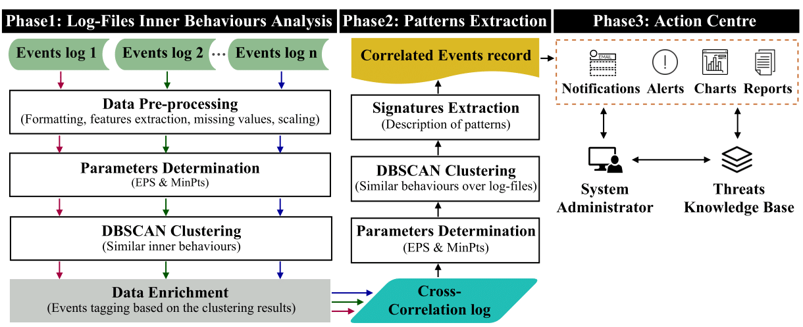
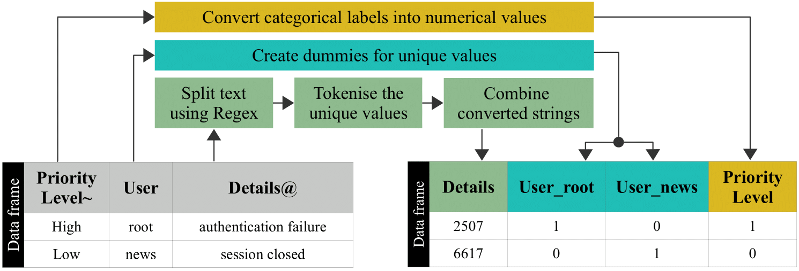
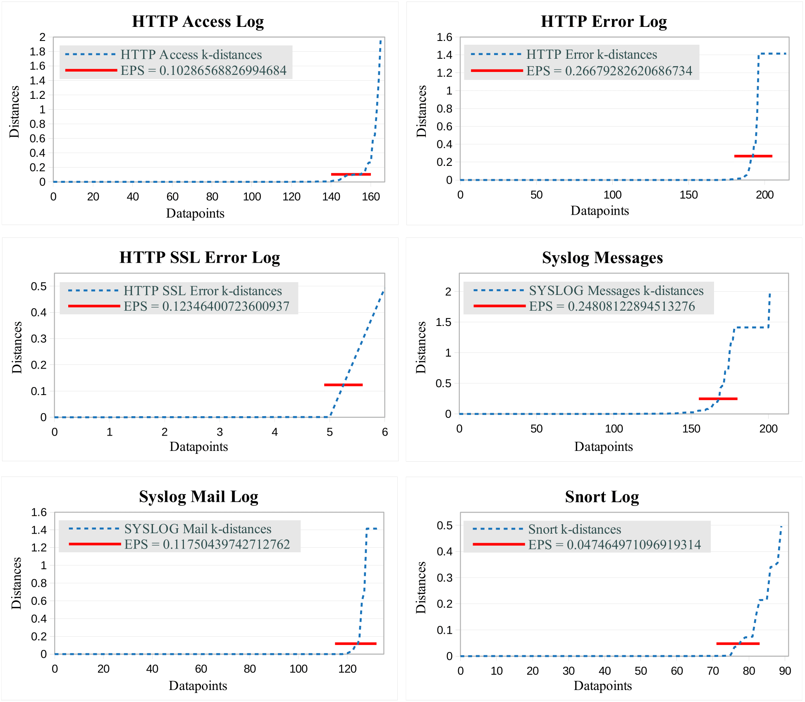
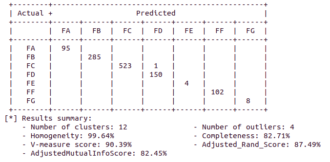

# UAHL {Unsupervised Analysis Framework for Heterogenous Log-Files}
**UAHL** is an unsupervised patterns extracting framework developed during my PhD research for the purpose of analysing heterogeneous log-files without the need of training data. The framework consists of two main phases of data analysis to extract inner-behaviours of log-files and then the patterns of those behaviours over analysed files. The framework components and used algorithms are explained in this webpage. Also, the labelled version of the used dataset for evaluation (SotM43) of the framework is provided and explained along with examples of results.  
We have decided to make the source code and the dataset available for other researchers to allow the replicability and to help others understanding our approach of analysing the heterogeneous log-files.
As aforementioned, the framework is part of an academic study made by <a href="http://twitter.com/cestrumn" target="_blank">`Ahmed A. Alghamdi`</a> and <a href="http://www.cs.man.ac.uk/~regerg/" target="_blank">`Giles Reger`</a>. Thus, if you are using our source code or the labelled version of the dataset in a scientific paper, please, cite our published paper:

<!-- The paper citation needs to be re-checked later -->
<!-- ### <a name="OurPaper"></a> -->
### <a name="OurPaper"></a>
<!-- [THIS LINE TO UPDATED WHEN THE PAPER PUBLISHED] -->
> A. Alghamdi and G. Reger, "Pattern Extraction for Behaviours of Multi-StageThreats via Unsupervised Learning", in *IEEE Cyber Science*, 2020.

BibTeX entry:
> WILL BE UPDATED WHEN THE PAPER PUBLISHED
<!-- @article{WILL BE UPDATED WHEN THE PAPER PUBLISHED,  
    title       = {Pattern Extraction for Behaviours of Multi-StageThreats via Unsupervised Learning},  
    author      = {A Alghamdi, Ahmed and Reger, Giles},  
    doi         = {WILL BE UPDATED WHEN THE PAPER PUBLISHED},  
    url         = {WILL BE UPDATED WHEN THE PAPER PUBLISHED},  
    year        = 2020,  
    month       = {June},  
    pages       = {8},  
    organization={IEEE},  
    publisher   = {TextHere},  
    volume      = {TextHere},  
    number      = {TextHere},  
    author      = {TextHere},  
    journal     = {TextHere}   
}-->

**Code Developer:** Ahmed Abdulrahman Alghamdi  
**For queries about the framework, reach out to me at one of the following places:**
>- Twitter:  <a href="http://twitter.com/cestrumn" target="_blank">`@cestrumn`</a>  
>- Linkedin:  <a href="https://www.linkedin.com/in/alghamdi-ahmed/" target="_blank">`Ahmed A. AlGhamdi`</a>

**Notes:** 
- The folder <a href="./UAHL" target="_blank">`UAHL`</a> contains the framework's source code.
- The labelled dataset (and its details) used for evaluating the framework is located in the folder <a href="./Labelled_SotM34_dataset" target="_blank">`Labelled_SotM34_dataset`</a>
- The folder <a href="./Analysis_reports/" target="_blank">`Analysis_reports`</a> contains technical reports performed by other researchers for the SotM34 dataset. Those reports manually analysed the dataset and stated the characteristics of attacks inside the dataset.
- The file <a href="./Analysis_reports/Incidents_Description.txt" target="_blank">`Analysis_reports/Incidents_Description.txt`</a> contains details of suspected incidents exist in the SotM34 dataset. The file includes sources and descriptions of each incident (associated IP address, incident types, entries location, numbers of the entries, status codes, and other notes).

---

## Dependencies
  - **Required packages:** Numpy, Scipy, Pandas, Matplotlib, Sklearn, <a href="https://pypi.org/project/PrettyTable/" target="_blank">`Prettytable`</a>
  - **Platform:** The framework was developed on a Linux machine using python 3.6

---

## UAHL anatomy
To extract inner-behaviours and their correlations from the collected  heterogeneous log-files, the framework is constructed by integrating two main phases of unsupervised data analysis along with an action centre (see Fig. 1).

<p align="center">
  <br/>  
  <sub>Figure 1 - UAHL framework structure</sub>
</p>

**Phase 1 - Individual log-files analysis:**  
The goal of this phase is to identify sets of behaviours inside each imported log-file using an unsupervised clustering method.
1. *Data pre-processing:* The preprocessing step includes converting the log-files from their original format into data frames with feature sets that exist in the log-files. Non-numeric columns in the data frames are converted into numerical values based on the nature of data inside those columns (see Fig. 2) as follows:  
      * Nominal Categorical Data:  Descriptive values that have no connections between them (e.g. Names of devices)
      * Ordinal Categorical Data: Values of this type have logical order or scale between them (e.g. Priority Levels)
      * Text Data: such as web links, directories, and punctuation. (e.g: *”File does not exist: /var/www/html/scripts”*)

    This encoding method keeps the relations of values in columns when converting data thus ensuring the efficacy of clustering (as confirmed in our experiments). After applying the data conversion, the framework scales values in dataframes to bring all features to the same level of immensity using the MinMaxScaler.

  <p align="center">
    <br/>
    <sub>Figure 2 - Steps of encoding non-numerical values in UAHL<br/> (Symbols are added at the end of features’ names to indicate their types) </sub> 
  </p>

2. *Data clustering and Parameters calculation:* UAHL uses <a href="https://www.aaai.org/Papers/KDD/1996/KDD96-037.pdf?source=post_page---------------------------" target="_blank">`DBSCAN`</a> as a clustering algorithm. Also, it automatically calculates optimal values for the parameters before applying the clustering process.  
   Non-common features in all log-files are used for clustering at this phase. The common features tend to be those belonging to instances of a particular kind of behaviour (e.g. source/destination IP address and time) rather than inherent characteristics of the behaviour itself.

3. *Data enrichment:* Resulting predicted labels from the previous clustering process represent sets of behaviours inside the processed log-files. Those labels are used to tag all events in the dataframes. Phase2 will use those tags to link behaviours.

**Phase 2 - Patterns extraction over the analysed log-files:**  
This phase aims to correlate behaviours based on a set of common features that exist in log-files.

1. *Cross-Correlation Log:*  All processed log-files  from Phase1 are combined into the Cross-Correlation Log  (CCL). The common features in log-files are used as a set of features for the CCL. The purpose of combining events in the CCL is to construct patterns of behaviours. The parameter calculation and the clustering processes are applied the same way as Phase1. The data preprocessing  step is extended to consider date and time (these columns are combined and converted into Unix-format as this captures more accurate time differences between events and is compatible with DBSCAN).  

2. *Signatures  Extraction:* Clusters resulting from the second clustering step represent patterns of behaviours. Descriptive signatures are generated for those patterns.  Thus similarities between them can be identified. A signature for a pattern consists of Frequency rate, Involved IP addresses, inner behaviours’ tags, start and end datetimes, bag of words, events amount, filenames, ports and status codes.

3. *Correlated Events record (CER):* The extracted signatures are then stored in CER which is accessible by the Action Center. Signatures stored in the CER represent patterns of behaviours exist in the analysed log-files.  

---

## Usage
To run the framework, you need to pass the log-files directory. See the following examples:

``` console
$ python3 UADF/UADF.py Labelled_SotM34_dataset/*  # Imports all CSV files into the framework
```

---

## Outputs
* UAHL calculates the optimal values for the clustering parameters. Plots of distances are created for each log-file  
  <p align="center">
    <br/>

* The framework also shows details about the performance and results. Homogeneity, Completeness, V-measure, ARI, and AMI metrics are used to show the results of clustering in the framework.
  <p align="center">
    <br/>

* An example for the framework's resulting files exists in the folder: <a href="./UAHL/Results-20200529165453/" target="_blank">`"./UAHL/Results-20200529165453"`</a>

---

## Learn more about the framework
More details about the framework structure and the applied analysis methods can be found in our published paper [[click here]](#OurPaper)

---

## Contributing
If you are interested in fixing issues and contributing to the framework code, please contact me directly or send a Pull Request. Also, if you are intrested in this felid of research, you may contact me for research collaburation.
